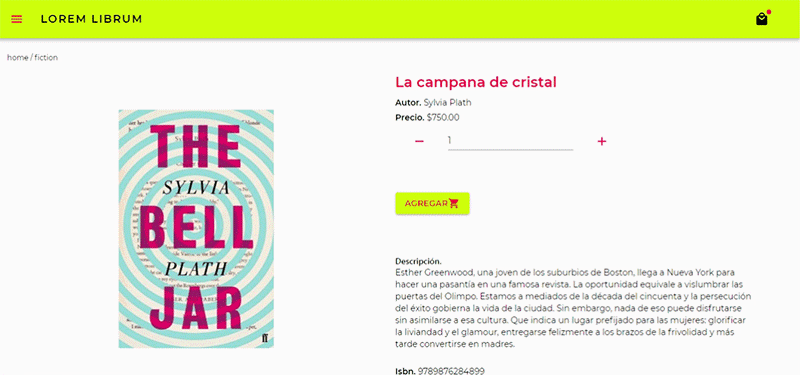
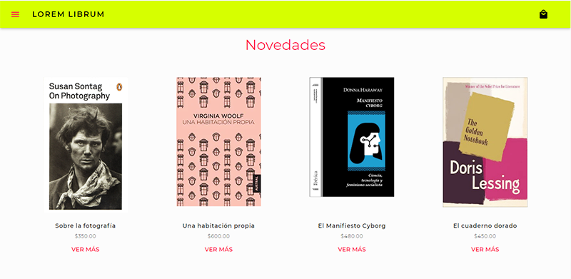
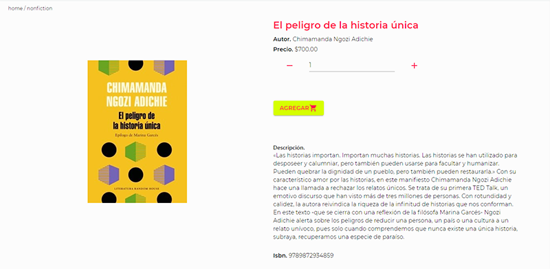
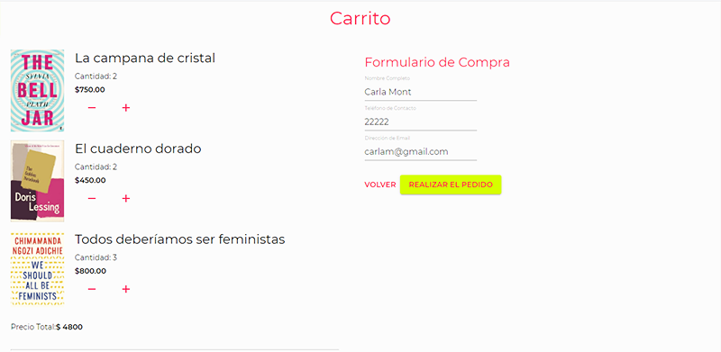
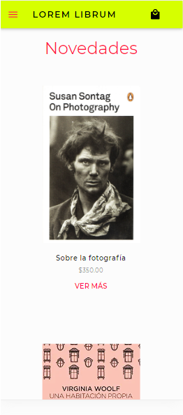
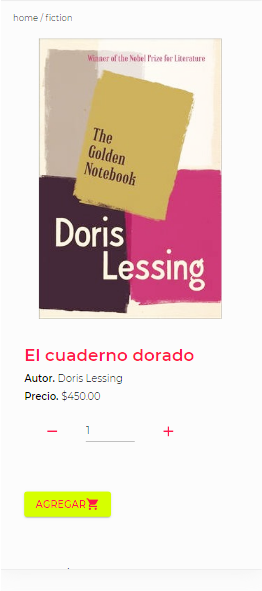
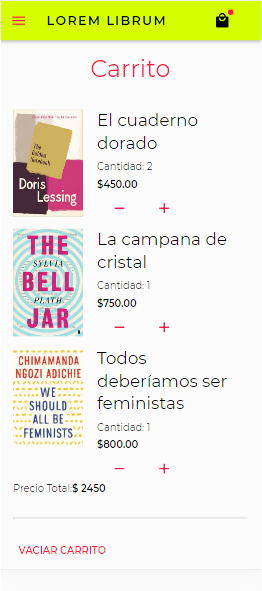

# LoremLibrum
Online Bookstore :books:

This project was bootstrapped with [Create React App](https://github.com/facebook/create-react-app).

## Available Scripts

In the project directory, you can run:

### `npm run start`

Runs the app in the development mode. 
Open [http://localhost:3000](http://localhost:3000) to view it in the browser.

The page will reload if you make edits. 
You will also see any lint errors in the console.

### `npm run build`

Builds the app for production to the `build` folder. 
It correctly bundles React in production mode and optimizes the build for the best performance.

The build is minified and the filenames include the hashes. 
Your app is ready to be deployed!

## Navigation Preview

  
  

## Desktop version :computer:
  
  
  
  

## Mobile version :iphone:
  
  
  

## Contribute
- Fork this Repo
- Create a Pull Request
- Ask for my review
- Push your changes

## Extra Docs
- [Environment](docs/Environment.md)